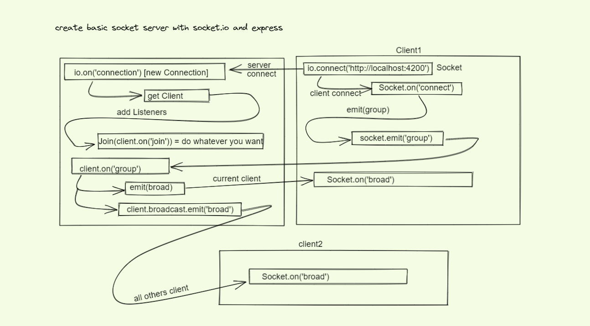

# Introduction

A basic experiment to setup Socket chat in Node app.

## Installation

### Client Side

- `cd chat-client-1`
- `npm install`
- `npm run dev`

### Server Side

- `cd chat-server`
- `npm install`
- `npm run dev`

